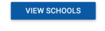

Lucky8
================


Hi! My name is Lucky, and I'll be helping you explore Boston high schools.

When you know better, you do better. Where you go to high school impacts you and
the odds that you will graduate and go on to college.

You can be successful at any school but picking the right school increases the
odds that you'll achieve your goals. Use this information, but it is still up to
you to choose wisely and put in the work once you get to high school.

[](http://lucky8.herokuapp.com/schools)

Getting Started for Teachers
-------------
This app can help you and your students look up high school information in the Boston area. To help your students understand how this app works, we created a scavenger hunt as lesson plan for you. You can print out the sheet below, and ask students to fill out the numbers in 20-30 mins. To make it less tedious, you could fill in some of the blanks ahead of time.
[Scavenger Hunt Lesson Plan](https://github.com/geoffreylitt/lucky8/raw/master/ScavengerHunt_HSGuideSite.docx)


Getting Started for developers
---------------
### Running the scraper

This rake task scrapes new stats for all schools from the Mass DESE website.
```
$ rake scrape
```
### Processing the school images
Run the following to generate a wget script to download all the images.
```ruby
School.all.each{|s| puts "wget \"#{s.image_url}\" -O app/assets/images/school_#{s.id}.jpg"};nil
```
Download all images in the `app/assets/images` folder and resize:

```bash
mogrify -resize 640x640 app/assets/images/school_*.jpg
```

Application requirement

### Ruby on Rails

This application requires:

- Ruby 2.0.0
- Rails 4.1.5

Learn more about [Installing Rails](http://railsapps.github.io/installing-rails.html).

Credits
-------

License
-------
